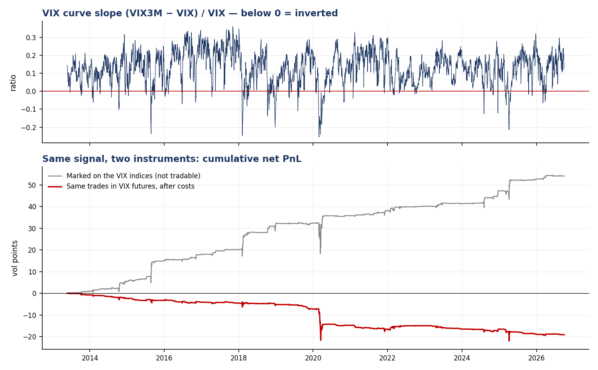

# Relative-value volatility research

[](https://github.com/0janne/vol-rv-research/actions/workflows/ci.yml)
[](https://github.com/0janne/vol-rv-research/actions/workflows/e2e.yml)

A point-in-time data pipeline, volatility signals, a walk-forward backtest and
the statistics to judge them, built to answer two questions honestly:

> **1. Is the equity variance risk premium a strategy, or a way of getting paid to hold a short tail?**
>
> **2. Does a signal on the shape of the VIX curve still work once you trade it in instruments that exist?**

The short answers, on S&P 500 data from 1990 and VIX futures from 2013, both
through September 2026:

1. The premium is real and statistically strong (Newey–West *t* = 4.4 over 441
   months), but it comes with a skew of −10 and a worst month that erases five
   years of carry.
2. **No.** A term-structure signal with a Sharpe of 0.95 (*t* = 4.3) and
   *positive* skew on the VIX indices turns into **−0.77 (*t* = −2.6) with
   skew −7.0** when the same trades are put on in VIX futures. Before costs it
   is 0.21, and not distinguishable from zero.



---

## Findings

Monthly, non-overlapping net PnL in **volatility points** per unit of vega
notional. *t* is Newey–West (Bartlett kernel, automatic bandwidth); the
interval is a 95% circular block bootstrap (6-month blocks) for the annualised
Sharpe. Full table: [`reports/inference.csv`](reports/inference.csv).

| Strategy | Period | Sharpe | NW *t* | 95% CI | Skew | Worst month |
|---|---|---|---|---|---|---|
| Always-on short variance | 1990–2026 | 0.85 | 4.41 | [0.28, 2.50] | −10.1 | −129.6 |
| VRP-conditioned (fixed params) | 1990–2026 | 0.76 | 3.80 | [0.23, 1.81] | −6.5 | −37.3 |
| VRP walk-forward (out of sample) | 1994–2026 | 0.80 | 3.89 | [0.24, 2.02] | −6.6 | −53.0 |
| Curve signal, **marked on VIX indices** † | 2013–2026 | 0.95 | 4.26 | [0.58, 1.43] | +2.5 | −6.2 |
| Same trades, **VIX futures**, before costs | 2013–2026 | 0.21 | 0.72 | [−0.31, 1.26] | −6.4 | −5.2 |
| Same trades, **VIX futures**, after costs | 2013–2026 | **−0.77** | −2.64 | [−1.39, −0.50] | −7.0 | −5.6 |
| Futures, signal from the futures curve | 2013–2026 | −0.58 | −2.00 | [−1.02, −0.06] | −3.1 | −3.2 |
| Futures, M3 − M1 back leg (tenor-matched) | 2013–2026 | −0.30 | −1.06 | [−0.62, 0.33] | −9.6 | −13.9 |

† Not tradable. Kept as the counterfactual.

**1. The daily Sharpe of short variance is an artefact.** Always-on short
variance shows 3.32 on daily data and 0.85 on monthly. The overlapping 21-day
holding periods autocorrelate the daily series; the monthly buckets do not
overlap, so that is the figure to quote.

**2. The premium is real, the payoff is a short tail.** The strategy wins on
83% of days and returns about 25 vol points a year, and its worst month
(March 2020) loses 130 — five years of carry.

**3. Conditioning buys survivability, not return.** Trading only when the
premium is rich relative to its own history roughly halves the drawdown and
cuts the worst month by 60–70%. Monthly Sharpe does not improve (0.85 → 0.80).
Parameters chosen on an expanding window and applied blind give up almost
nothing, but the **deflated Sharpe** (Bailey & López de Prado, 2014) across the
12 configurations tried is 0.90 — below the conventional 0.95 bar. Selecting
the best of 12 would produce an annualised Sharpe of 0.39 by luck alone.

**4. Index versus tradable is the whole result.** The VIX index mean-reverts
predictably after spikes, and the calendar signal captures that: on the
indices it earns a Sharpe of 0.95 with positive skew. But no one can buy the
index. VIX futures already price the expected reversion — a future on an
elevated VIX trades well below spot — so the predictable part of the index move
is not available as a return. In futures the same trades earn nothing before
costs and lose after them, and the tail flips from +2.5 to −7.0. Building the
signal from the futures curve itself, or matching the back leg's tenor to
VIX3M, does not rescue it.

**5. What the first version got wrong.** The previous version of this
repository reported the index-level result as a tradable relative-value
finding. It was not. The futures data, the roll logic and the inference layer
were added to test that claim, and the claim did not survive.


---

## Design: what decides whether the numbers mean anything

### Point-in-time, enforced rather than intended

Every fact table carries `ingested_at`. Loaders upsert on natural keys, so a
re-run applies corrections without duplicating rows, and derived tables are
rebuildable from raw. Constraints live in the schema — an option expiry before
its snapshot, a futures settlement after its expiry or a bar whose high is
below its close all fail at the boundary.

### Two things are called "VRP" and only one is tradable

```
ex-post VRP    implied² at t  −  variance realised over (t, t+H]     ← the payoff
VRP proxy      implied  at t  −  volatility realised over (t−H, t]   ← the signal
```

`signals/` never imports the forward estimator. Only `backtest/` does, to
settle a position that was already opened.

### The no-lookahead test

`tests/test_no_lookahead.py` multiplies all data after a cut point by a random
factor of 3–6× and asserts that every earlier signal value is unchanged. It
failed on first run: the position sizer normalised by the full-sample median of
implied volatility, so a 1994 position knew the average volatility of the next
thirty years.

### Execution timing and rolls

A signal observed at the close of day *t* is executed at the settlement of day
*t+1* (trade-at-settlement) and earns from there. The futures book holds the
first contract with more than five business days to expiry and the next one
out; PnL on a roll day is computed on the contracts held the day before, so a
roll never shows up as a price jump. Costs: 0.05 vol points per leg per trade,
four contract-units per roll. `tests/test_futures.py` checks the expiry rule
against every published contract and that a uniform price drift produces zero
spread PnL through rolls.

### The option-chain recorder

A GitHub Action records the full SPY chain (≈11,000 quotes) after every US
close into Postgres. It is point-in-time by construction, with one exception
found in September: on US holidays the data source still serves the previous
session, which was being stored under the holiday's date. The recorder now
stamps each chain with the date of its last regular-session print and skips the
day when that is not today; `volrv audit-snapshots` flags any repeated day
already in the table.


---

## What this does **not** model

- **Variance PnL is priced off VIX², not traded.** VIX² is close to the fair
  30-day variance swap rate but not equal to it, and the backtest has no
  strike-level bid-ask or discrete-hedging error. The futures results do not
  share this limitation.
- **Futures begin in 2013**, the start of CBOE's public per-contract files. The
  tradable test never sees 2008.
- **No margin, financing or capacity.** A February 2018 loss is a mark here; in
  practice it was a margin call.
- **Costs are a single number per leg.** Liquidity disappears exactly when
  these strategies need to trade.

---

## Running it

```bash
git clone https://github.com/0janne/vol-rv-research && cd vol-rv-research
pip install -e ".[dev]"

docker compose up -d                    # Postgres 16 on :5433 (optional; SQLite by default)
volrv init-db                           # apply sql/ migrations (idempotent)
volrv ingest --source all               # SPX OHLC, VIX complex, ~170 VIX futures contracts
volrv build-features                    # realised vol estimators, VRP, term structure
volrv report                            # backtests, inference table, figures
volrv check-claims                      # the headline claims above, as pass/fail checks

pytest -q && ruff check src tests
```

The **End-to-end** workflow runs exactly this from a clean checkout every Monday
and on every code change, so the numbers in this README are re-derived from the
public sources rather than trusted from the day they were written.

## Data

| Source | Series | Coverage |
|---|---|---|
| CBOE (free daily CSVs) | VIX, VIX9D, VIX3M, VIX6M, VVIX, SKEW, SPX | VIX from 1990 |
| CBOE Futures Exchange | VIX futures settlements, every monthly contract | 2013 onward |
| Yahoo Finance | SPX daily OHLC (range-based estimators need it) | from 1970 |
| `volrv snapshot` | SPY option chains, recorded daily | from August 2026 |

No vendor data is redistributed here — only the loaders.

## Layout

```
sql/                        001 schema · 002 VIX futures
src/volrv/
  ingest/                   cboe · cboe_futures · yahoo · snapshot (holiday-safe)
  vol/                      five realised-vol estimators · constant-maturity curve
  signals/                  vrp · calendar — point-in-time only
  backtest/engine.py        variance tranche ladder · spread engine · walk-forward
  backtest/futures.py       contract selection, rolls, tradable spread PnL
  backtest/inference.py     Newey–West, block bootstrap, deflated Sharpe
src/volrv/claims.py         the README's headline claims as executable checks
tests/                      57 tests, incl. the no-lookahead guard
```

## References

- Bailey, D. H. & López de Prado, M. (2014). The Deflated Sharpe Ratio. *Journal of Portfolio Management*.
- Bollerslev, T., Tauchen, G. & Zhou, H. (2009). Expected Stock Returns and Variance Risk Premia. *Review of Financial Studies*.
- Carr, P. & Wu, L. (2009). Variance Risk Premiums. *Review of Financial Studies*.
- Johnson, T. L. (2017). Risk Premia and the VIX Term Structure. *Journal of Financial and Quantitative Analysis*.
- Newey, W. K. & West, K. D. (1994). Automatic Lag Selection in Covariance Matrix Estimation. *Review of Economic Studies*.
- Simon, D. P. & Campasano, J. (2014). The VIX Futures Basis: Evidence and Trading Strategies. *Journal of Derivatives*.

---

MIT licensed. Built by [Janne Ewert](https://github.com/0janne), BSc Physics, ETH Zurich.
