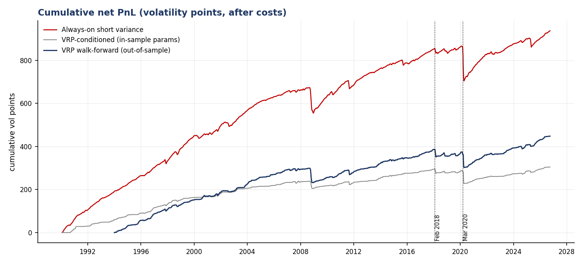
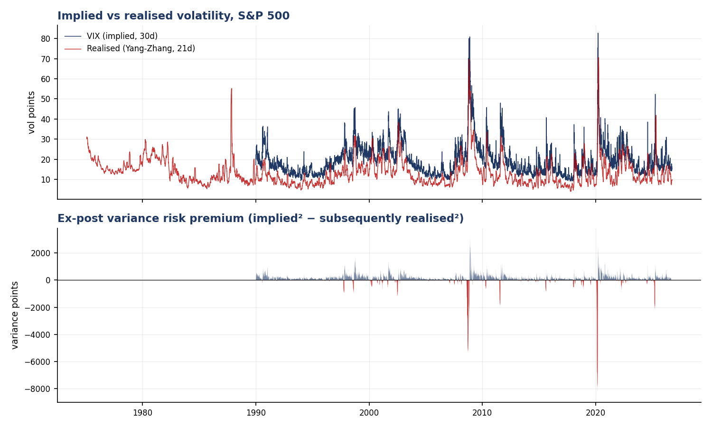
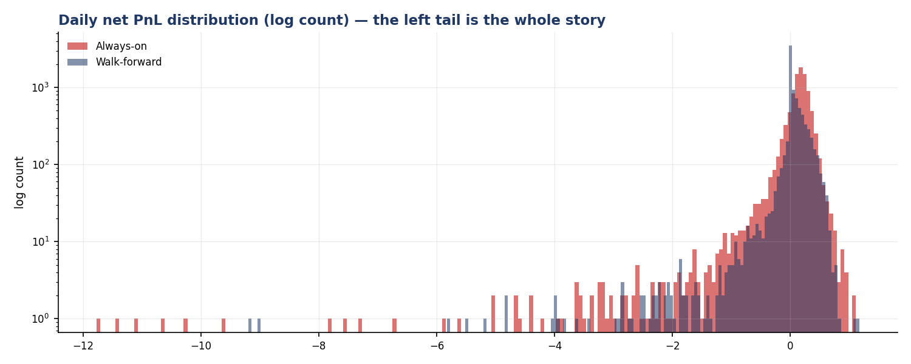

# Relative-value volatility research

A point-in-time data pipeline, two volatility signals, and a walk-forward backtest, built to
answer one question honestly:

> **Is the equity variance risk premium a strategy, or just a way of getting paid to hold a
> short tail?**

The short answer, over 36 years of S&P 500 data, is mostly the second. The more interesting
result is what happens when the same premium is traded in *relative* rather than outright
form — see [Findings](#findings).



---

## Findings

All PnL is in **volatility points** per unit of vega notional, net of costs. Data runs to
10 August 2026.

| | Always-on short variance | VRP-conditioned (in-sample) | VRP walk-forward (OOS) | Calendar relative value |
|---|---|---|---|---|
| Period | 1990–2026 | 1990–2026 | 1994–2026 | 2009–2026 |
| Annualised return | 25.50 | 8.33 | 13.72 | 3.65 |
| Annualised vol | 7.72 | 4.16 | 5.39 | 2.08 |
| **Sharpe (daily)** | **3.30** | **2.00** | **2.55** | **1.75** |
| **Sharpe (monthly)** | **0.84** | **0.76** | **0.80** | **1.30** |
| Max drawdown | −161.50 | −67.21 | −84.32 | −6.25 |
| Skew | −11.77 | −15.83 | −10.15 | **+5.74** |
| Excess kurtosis | 212.6 | 435.1 | 191.1 | 138.7 |
| Worst month | −129.57 | −37.30 | −53.04 | −1.02 |
| Time in market | 100% | 46% | 68% | 35% |
| Annualised turnover | 0.00 | 35.9 | 49.2 | 16.0 |

**1. The daily Sharpe is an artefact.** Always-on short variance shows 3.30 daily and 0.84
monthly. The gap is not a rounding difference — it is the overlapping 21-day holding periods
smoothing the daily series. The monthly figure is computed on non-overlapping buckets and is
the only one worth quoting. Any short-variance backtest advertising a daily Sharpe above 3
is reporting this artefact.

**2. The premium is real; the payoff distribution is the problem.** The strategy wins on 83%
of days and still carries skew of −11.8, kurtosis of 213, and a worst month of −129.6 vol
points against an annual return of 25.5. Roughly five years of carry disappears in a single
month. That is a short tail with a coupon, not an edge.

**3. Conditioning on the premium helps risk, not return.** Trading only when the VRP proxy is
rich relative to its own trailing distribution cuts max drawdown by ~48% (−161.5 → −84.3
out-of-sample) and worst month by 59%, at the cost of roughly half the return. Monthly Sharpe
barely moves: 0.84 → 0.80. **The conditioning buys survivability, not alpha** — a fair result,
and not the one I expected when I started.

**4. Honest parameter selection costs almost nothing here.** The walk-forward version chooses
its lookback and entry threshold on an expanding window and trades the following year blind.
It gives up little against the in-sample version, which mostly says the strategy is not very
parameter-sensitive — the premium is a broad phenomenon, not a tuned one.

**5. The relative-value version has the opposite tail.** The calendar trade — front variance
against back variance, equal and opposite vega, expressing curve *shape* rather than level —
earns a monthly Sharpe of 1.30 with **positive** skew of +5.7 and a worst month of −1.0.
It is in the market only 35% of the time. Trading the same underlying premium in spread form
inverts the sign of the tail. This is the whole argument for relative value in one number, and
it is the result I would want to attack first if I had more data.



---

## Design: three things that decide whether the numbers mean anything

### Point-in-time, enforced rather than intended

Every fact table carries `ingested_at`. Loaders upsert on natural primary keys, so re-running
one applies corrections without duplicating rows, and derived tables are always rebuildable
from raw. Constraints live in the schema — `option_quote` rejects an expiry before its
snapshot date, `underlying_daily` rejects a bar where the high is below the close — so bad
data fails at the boundary rather than three transformations downstream.

### Two things are called "VRP" and only one is tradable

```
ex-post VRP    implied² at t  −  variance realised over (t, t+H]     ← the payoff
VRP proxy      implied  at t  −  volatility realised over (t−H, t]   ← the signal
```

The first is not knowable at `t`. `signals/` never imports the forward estimator; only
`backtest/` does, and only to settle a position that was already opened.

### The no-lookahead test

`tests/test_no_lookahead.py` multiplies all data after an arbitrary cut point by a random
factor of 3–6× and asserts that every signal value *before* that point is bit-identical.

This is not decorative. It failed on first run and caught a genuine leak: the position sizer
normalised by `implied.median()` over the full sample, so the 1994 position knew the average
volatility of the following thirty years. It is now an expanding median. A code review would
probably not have caught that line; the test caught it immediately.



---

## What this does **not** model

Stated plainly, because the numbers above are not tradable Sharpes:

- **PnL is modelled at index level.** A one-month variance position is priced off the VIX and
  settled against realised variance; the calendar trade is marked off the constant-maturity
  curve. Neither VIX nor VIX3M is directly tradable. A real implementation needs the option
  chain or the futures strip.
- **No strike-level bid-ask.** Costs are a flat 0.50 vol points round-trip on the variance leg
  and 0.20 on the calendar spread. Deliberately conservative, but a single number cannot
  capture the fact that liquidity vanishes exactly when the strategy needs to de-risk.
- **No delta hedging path.** A variance swap is replicated by a strip of options plus a
  continuously rebalanced delta. The discrete-hedging error is real and is not here.
- **No financing, margin, or capacity.** The February 2018 loss is modelled as a mark. In
  practice it was a margin call.
- **VIX3M starts in 2009**, so the calendar result never sees 2008. Its positive skew is
  measured over a period containing 2018 and 2020 but not the crisis that would test it hardest.

The natural next step is [`snapshot.py`](src/volrv/ingest/snapshot.py) — recording real option
chains daily so the surface can be fitted (SVI, with Durrleman and calendar constraints) and
the PnL computed on quotes rather than an index proxy.

---

## Running it

```bash
git clone https://github.com/0janne/vol-rv-research && cd vol-rv-research
pip install -e ".[dev]"

docker compose up -d                    # Postgres 16 on :5433
cp .env.example .env

volrv init-db                           # apply sql/ migrations (idempotent)
volrv ingest --source all               # ~14k days of SPX OHLC + the VIX complex
volrv build-features                    # realized vol estimators, VRP, term structure
volrv report                            # backtests + figures into reports/

pytest -q && ruff check src tests
```

Postgres is the intended store; the test suite runs against SQLite so CI needs no server.
Set `DATABASE_URL` to switch.

To start accumulating real chains, schedule the recorder after the US close:

```bash
volrv snapshot --underlying SPY         # appends one point-in-time chain per day
```

---

## Data

| Source | Series | Coverage |
|---|---|---|
| CBOE (free daily CSVs) | VIX, VIX9D, VIX3M, VIX6M, VVIX, SKEW, SPX | VIX from 1990 |
| Yahoo Finance | SPX daily OHLC (range-based estimators need it) | from 1970 |
| `volrv snapshot` | SPY option chains | forward from first run |

No vendor data is redistributed in this repository — only the loaders.

## Layout

```
sql/001_schema.sql          tables, keys, constraints
src/volrv/
  ingest/                   cboe.py · yahoo.py · snapshot.py
  vol/realized.py           close-to-close, Parkinson, Garman-Klass,
                            Rogers-Satchell, Yang-Zhang
  vol/term.py               constant-maturity curve (interpolated in total variance)
  signals/                  vrp.py · calendar.py — point-in-time only
  backtest/engine.py        tranche ladder, vega-neutral spread, walk-forward
  backtest/metrics.py       daily and non-overlapping monthly statistics
tests/                      37 tests, incl. the no-lookahead guard
```

## Notes on method

Constant-maturity vols are interpolated in **total variance** against calendar days, not in
volatility — interpolating vol directly is not arbitrage-consistent across tenors.

The variance carry book is a **ladder of overlapping tranches**: one opened per day, each
holding 1/H of capital, so exactly one settles per day and the daily PnL series contains no
double counting. The series is still autocorrelated, which is precisely why the monthly Sharpe
is reported alongside it.

Yang-Zhang is the default realised estimator for signals because it is the only one of the five
that handles both drift and the overnight gap — and overnight gaps are when equity index
volatility actually happens.

---

MIT licensed. Built by [Janne Ewert](https://github.com/0janne), BSc Physics, ETH Zurich.
